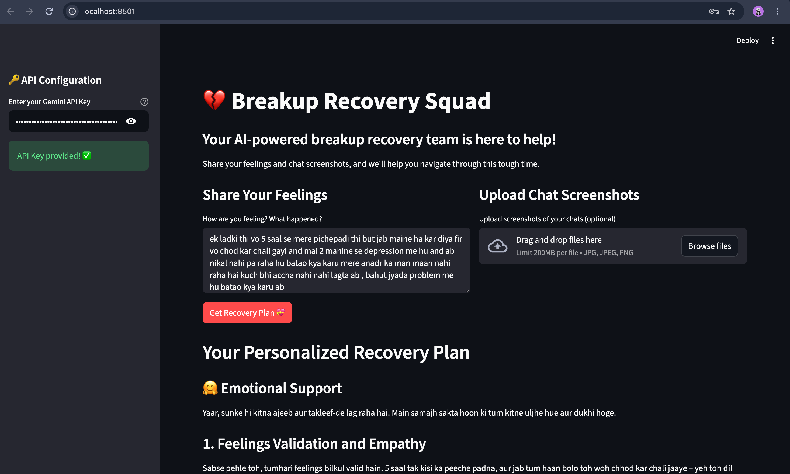
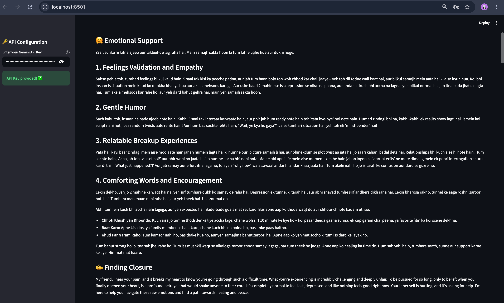
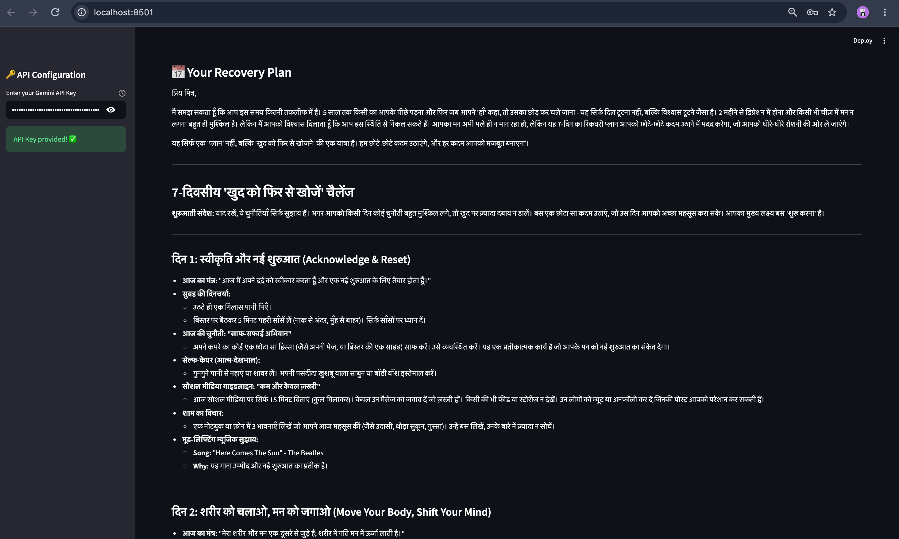
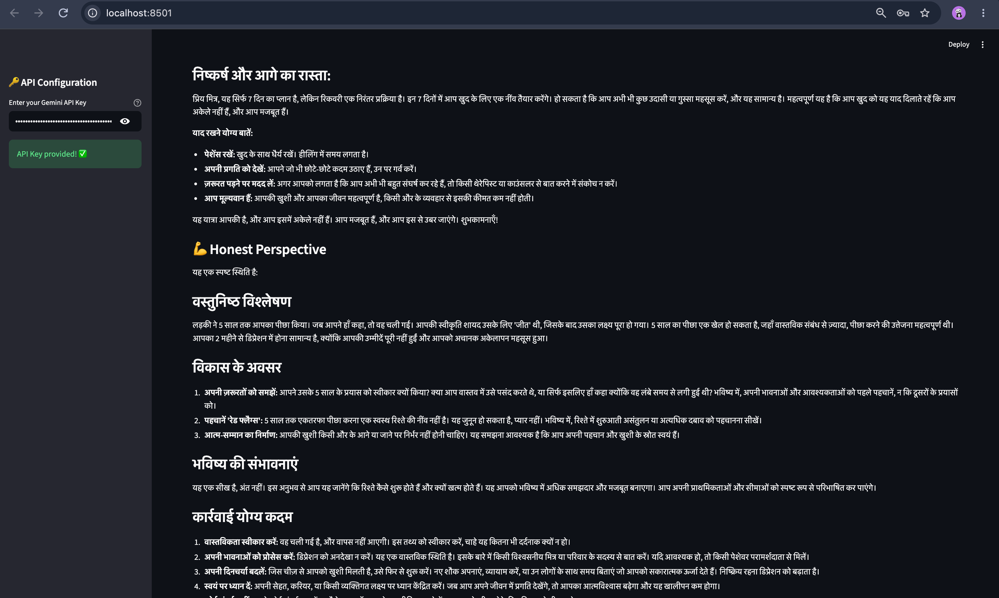
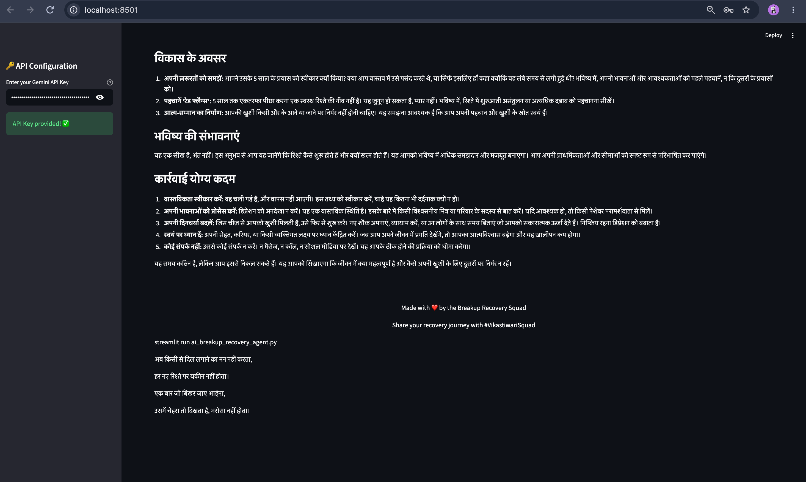

# 💔 AI Breakup Recovery Agent

<p align="center">
  
  
  
</p>

<p align="center">
  
  
</p>

## 🚀 About the Project
...

# 💔 Breakup Recovery Squad

An AI-powered breakup recovery app built with **Streamlit, Agno, and Google Gemini**.

## ✨ Features

- 🤗 Emotional Support
- ✍️ Closure Messages
- 📅 7-Day Recovery Plan.
- 💪 Brutal Honesty
- 🖼️ Chat Screenshot Analysis


## 🛠️ Tech Stack

**Python • Streamlit • Agno • Gemini 2.5 Flash • DuckDuckGo Tools**

## 🚀 Run Locally

````markdown
## 🚀 Run Locally

### 1. Clone the Repository

```bash
git clone https://github.com/Vikas-tiwari-dot/breakup-recovery.git
cd breakup-recovery
````

### 2. Install Dependencies

```bash
pip install -r requirments.txt
```

### 3. Run the Streamlit App

```bash
streamlit run ai_breakup_recovery_agent.py
```

The application will be available at:

```
```


Open `http://localhost:8501`

## 🔑 API Key

Enter your **Gemini API Key** in the sidebar.

Get it from [Google AI Studio](https://aistudio.google.com/app/apikey).

## 📁 Structure

```text
breakup-recovery-squad/
├── ai_breakup_recovery_agent.py
├── requirements.txt
├── README.md
├── .gitignore
├── .env
└── screenshots/
    ├── home.png
    ├── emotional-support.png
    ├── recovery-plan.png
    └── honest-perspective.png
```

## ❤️ Made With

**Streamlit • Agno • Google Gemini**

Made with ❤️ by **Vikas Breakup Recovery Squad** 